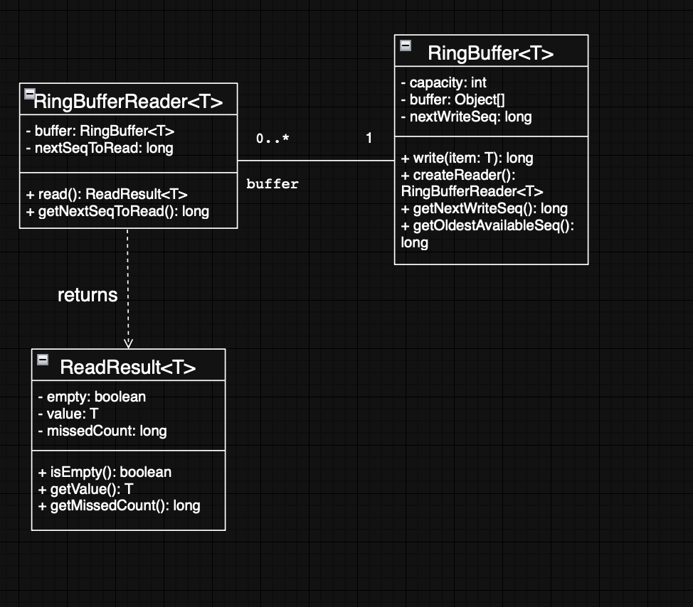

# Ring Buffer (Single Writer, Multiple Readers)

## Overview
This project implements a fixed-size **ring buffer** (capacity **N**) with:
- **Single writer** (`write()`)
- **Multiple independent readers** (each reader has its own cursor)
- **Overwrite on full** (new data overwrites the oldest)
- Slow readers may miss items; the reader reports how many were skipped (`missedCount`).

## Requirements Covered
- Fixed capacity N
- One writer calls `write()`
- Multiple readers read from the same buffer
- Each reader has its own reading position
- Reading by one reader does not remove items for other readers
- Writer may overwrite oldest items when full
- Slow readers may miss overwritten items (reported as `missedCount`)

## Design (Responsibilities)
### `RingBuffer<T>`
- Stores items in a fixed array (`buffer`)
- Uses a global sequence counter (`nextWriteSeq`)
- Writes to `buffer[seq % capacity]`
- Computes the oldest available sequence after overwrites
- Creates reader instances

### `RingBufferReader<T>`
- Keeps its own cursor (`nextSeqToRead`)
- Reads independently (does not affect other readers)
- Detects overwrite (if behind) and skips missed items

### `ReadResult<T>`
- `empty` → no new data
- `value` → returned item
- `missedCount` → number of skipped items due to overwrite

## UML Diagrams
### Class Diagram


### Sequence Diagram — `write()`


### Sequence Diagram — `read()`


## How to Run
### IntelliJ (recommended)
Open the project → run `DemoMain`.

### Terminal (optional)
```bash
javac -d out $(find . -name "*.java")
java -cp out DemoMain


